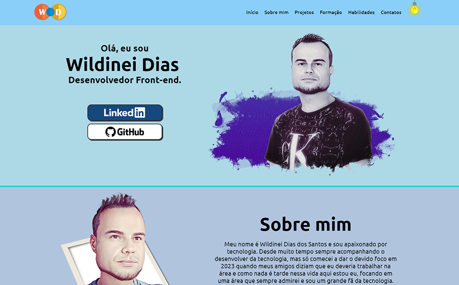
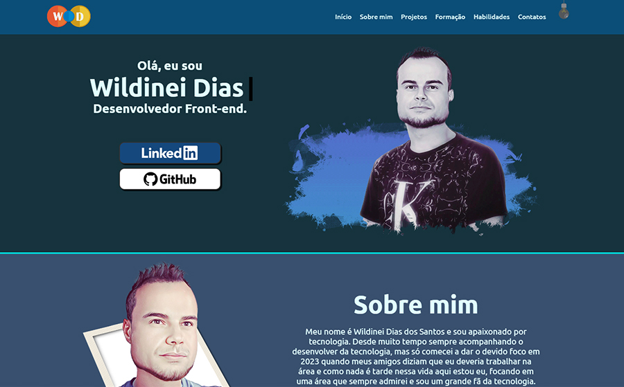
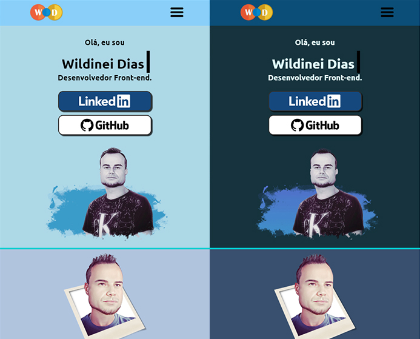
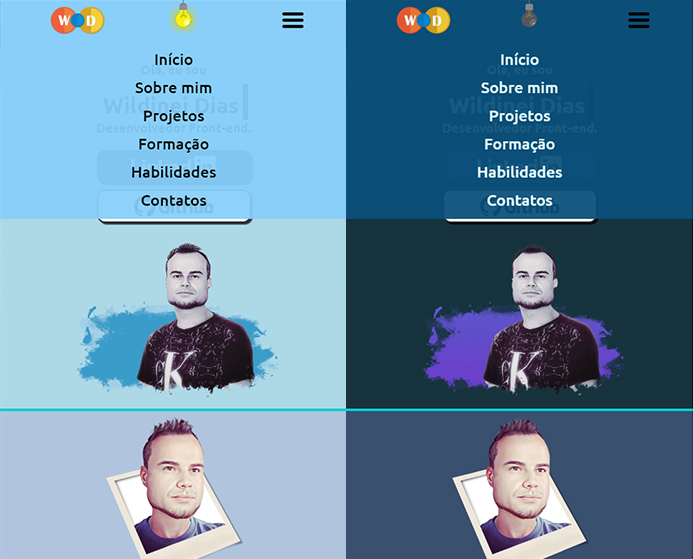

<h1>📰 <a href="https://wildinei.github.io/Portf-lio-wildinei/"> Portfólio </a></h1>

Esse é a versão desktop.

<h2>🖥️ - Modo claro</h2>

<h2>🖥️ - Modo escuro</h2>

<h1> Versão Mobile. Modo claro e escuro.</h1> 
<h2>📱 - Mobile.</h2>

<h2>📱 - Menu.</h2>

<h1>📃- Descrição</h1>

Meu portfólio. Aplicação criada para mostrar os projetos que irei desenvolver durante minha carreira.
